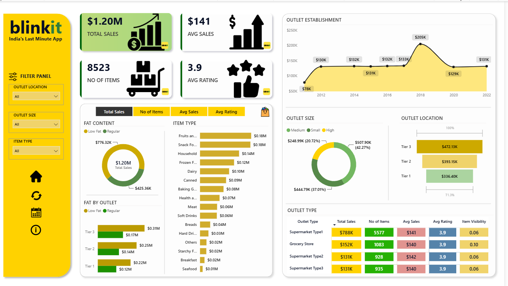

# Blinkit Grocery Sales Analytics

An end-to-end sales analytics project using **SQL, Excel, and Power BI** to analyze Blinkit's grocery sales data and identify key sales trends across products and outlets.

## 📊 Project Overview

This project analyzes **8,523 grocery sales records** to understand:

- Overall sales performance
- Sales by product/fat content
- Sales by item type
- Sales across outlet locations and sizes
- Sales trends by outlet establishment year
- Outlet-level performance metrics
- Average sales, ratings, item count, and item visibility

## 🛠️ Tools & Technologies

- **SQL (MySQL)** — Data cleaning, aggregation, and analysis
- **Excel** — Dataset/source data
- **Power BI** — Interactive dashboard and visualization

## 📌 Key KPIs

| KPI | Value |
|---|---:|
| Total Sales | $1.20M |
| Average Sales | $141 |
| Number of Items | 8,523 |
| Average Rating | 3.9 |

## 🔍 SQL Analysis

SQL was used to perform:

- Data cleaning and standardization
- Total sales calculation
- Sales analysis by fat content
- Sales analysis by item type
- Sales by outlet location
- Sales by outlet establishment year
- Sales contribution by outlet size
- Multiple performance metrics by outlet type

The complete SQL code is available in:

**`blinkitdb sql queries.sql`**

A visual showcase of the queries along with their Result Grids is available in:

**`SQL/blinkit_sql_query_result_showcase.pdf`**

## 📈 Power BI Dashboard

The Power BI dashboard provides an interactive view of:

- Total Sales
- Average Sales
- Number of Items
- Average Rating
- Outlet Establishment trends
- Outlet Size performance
- Outlet Location performance
- Fat Content analysis
- Item Type sales
- Outlet Type performance

Dashboard preview:



## 📁 Project Structure

```text
blinkit-sales-analytics/
│
├── PowerBI/
│   └── dashboard.pbix
│
├── SQL/
│   └── blinkit_sql_query_result_showcase.pdf
│
├── Screenshots/
│   └── powerbi-dashboard.png
│
├── blinkitdb sql queries.sql
└── blinkit Raw Data.xlsx
